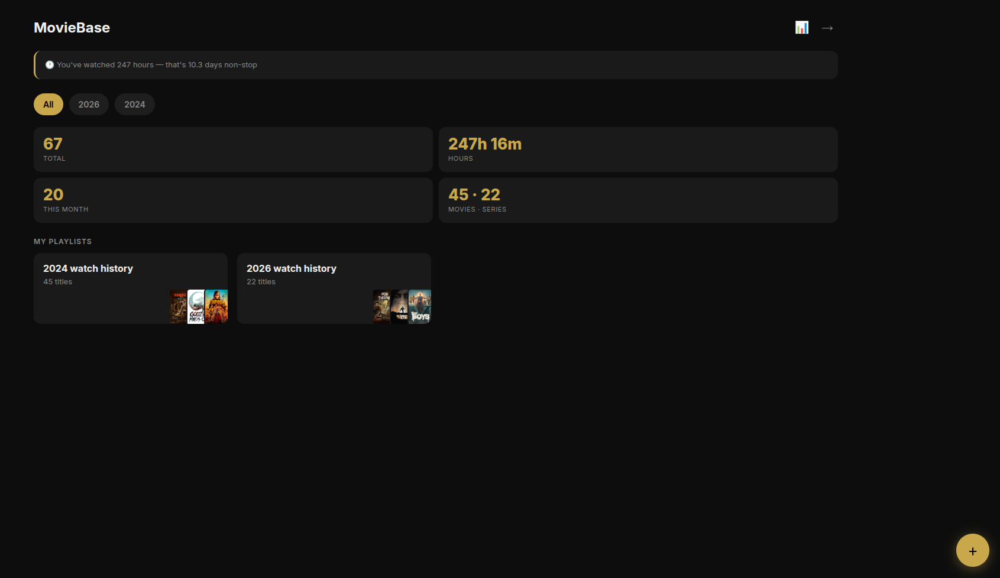
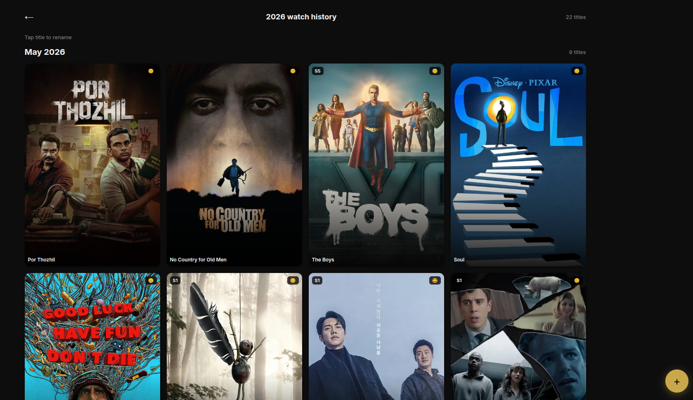
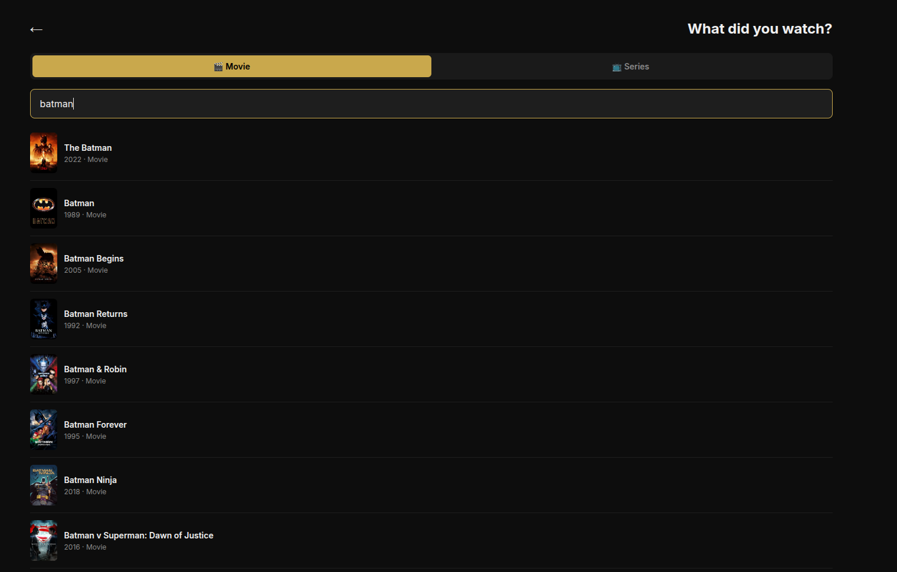

# 🎬 Playlog

A personal movie and web series tracking Progressive Web App (PWA). Built to log everything you watch, organize it into playlists, rate it, and generate a Spotify Wrapped-style stats card.

**Live:** [Playlog-pwa.vercel.app](https://Playlog-pwa.vercel.app)

---

## What It Does

- Search any movie or web series via TMDB API and add it to your collection
- For series, pick a specific season with its own poster
- Rate everything with a 5-emoji scale (😭 🙁 😐 😊 🤩)
- Organize your watches into named playlists
- Filter, sort, and view stats by year and month
- Generate a downloadable Wrapped card with your top stats
- Install directly from Chrome as a native-like app (PWA)
- Fully synced across all your devices via Firebase

---

## Tech Stack

| Layer | Tool |
|---|---|
| Frontend | Vanilla HTML, CSS, JavaScript |
| Database | Firebase Firestore |
| Auth | Firebase Authentication (Google Sign-In) |
| Movie Data | TMDB API |
| Hosting | Vercel |
| PWA | Web App Manifest + Service Worker |
| Stats Card | HTML Canvas API |

No frameworks. No npm. No build step. Pure static files.

---

## Features

**Core**
- Google Sign-In — your data is private and tied to your account
- Search movies and TV series with live TMDB results
- Season-level tracking for series (separate entry per season)
- Emoji rating system: 😭 🙁 😐 😊 🤩
- Month tagging for every entry — future months are blocked

**Organization**
- Create and rename playlists (e.g. "2026", "Horror Run", "Rewatches")
- Grid view with posters inside each playlist
- Mini poster collage preview on playlist cards
- Filter entries by type: All / 🎬 Movies / 📺 Series
- Sort entries by: Date Added, Rating, Month Watched, Type
- Move any entry to a different playlist
- Delete an entry or edit its rating and month after adding
- Tap any poster to see full entry details (title, rating, runtime, genre, month)

**Stats**
- Total titles watched and total days consumed
- Movies vs series breakdown
- Top genre (computed silently from TMDB data)
- Most active month
- Longest single watch
- Average rating
- Watch streak — longest consecutive months with at least one entry
- Your 🤩 picks (top rated entries)
- Fun facts and Deep Cuts computed from your data
- Deep Cuts: personality insights (movie person vs binger, tough critic vs generous rater, completion rate, etc.)

**Wrapped Card**
- Generates a 1080×1920 downloadable image
- Shows top 3 rated posters, key stats, top genre
- Filter by any year or month

**PWA**
- Installable from Chrome on Android and desktop
- Runs in standalone mode (no browser bar)
- App shell cached via Service Worker

---

## Project Structure

```
/
├── index.html          # Login screen
├── home.html           # Dashboard — stats + playlists
├── playlist.html       # Individual playlist grid view
├── add.html            # Add entry flow (search → season → rate)
├── stats.html          # Stats and Wrapped card
├── manifest.json       # PWA manifest
├── sw.js               # Service Worker
├── css/
│   └── main.css        # Single shared stylesheet
├── js/
│   ├── config.js       # Firebase + TMDB config (not committed)
│   ├── firebase-init.js
│   ├── auth.js
│   ├── firestore.js
│   ├── tmdb.js
│   ├── utils.js
│   ├── home.js
│   ├── playlist.js
│   ├── add.js
│   └── stats.js
└── assets/
    └── icons/          
```

---

## Setup (Self-Hosting)

### 1. Clone the repo

```bash
git clone https://github.com/Vishwajeeet/Playlog-pwa.git
cd Playlog-pwa
```

### 2. Create your config file

Create `js/config.js` (this file is gitignored):

```js
const APP_CONFIG = {
  firebase: {
    apiKey: "YOUR_FIREBASE_API_KEY",
    authDomain: "YOUR_PROJECT.firebaseapp.com",
    projectId: "YOUR_PROJECT_ID",
    storageBucket: "YOUR_PROJECT.appspot.com",
    messagingSenderId: "YOUR_SENDER_ID",
    appId: "YOUR_APP_ID"
  },
  tmdb: {
    key: "YOUR_TMDB_API_KEY",
    baseUrl: "https://api.themoviedb.org/3",
    posterBase: "https://image.tmdb.org/t/p/w500"
  }
};
```

### 3. Firebase setup

- Create a project at [console.firebase.google.com](https://console.firebase.google.com)
- Enable **Firestore Database** (production mode, region: asia-south1)
- Enable **Authentication** → Google Sign-In
- Set Firestore security rules:

```
rules_version = '2';
service cloud.firestore {
  match /databases/{database}/documents {
    match /users/{userId}/{document=**} {
      allow read, write: if request.auth != null
        && request.auth.uid == userId;
    }
  }
}
```

### 4. TMDB API key

- Create a free account at [themoviedb.org](https://www.themoviedb.org)
- Go to Settings → API → Create (Developer)
- Copy the v3 API key

### 5. Run locally

Open with [Live Server](https://marketplace.visualstudio.com/items?itemName=ritwickdey.LiveServer) in VS Code. Do not open as a plain file — Firebase Auth requires HTTP.

### 6. Deploy

Push to GitHub and connect to [Vercel](https://vercel.com). Set framework preset to **Other**, leave build command empty.

After deploying, add your Vercel URL to Firebase → Authentication → Authorized Domains.

---

## Data Model

All data lives under `users/{uid}/` in Firestore.

**Playlist document:**
```
name: string
createdAt: timestamp
updatedAt: timestamp
```

**Entry document:**
```
playlistId: string
tmdbId: number
title: string
type: "movie" | "series"
season: number | null
seasonName: string | null
poster: string (TMDB path)
releaseYear: number
runtime: number (minutes)
genres: string[]
monthWatched: number (1–12)
yearWatched: number
rating: number (1–5)
addedAt: timestamp
```

---

## Why Firebase Free Tier Works Forever

| Resource | Free Limit | Estimated Usage |
|---|---|---|
| Storage | 1 GB | ~6 MB over 10 years |
| Reads/day | 50,000 | ~200–500 per session |
| Writes/day | 20,000 | ~5–10 per day |

This app will never hit Firebase's free tier limits.

---

## Screenshots

### Home Dashboard


### Playlist View


### Add Movie / Series


---

## License

Personal use. Not open for contributions.